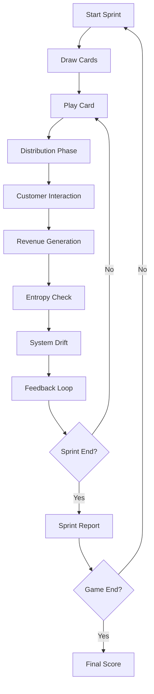
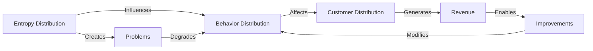
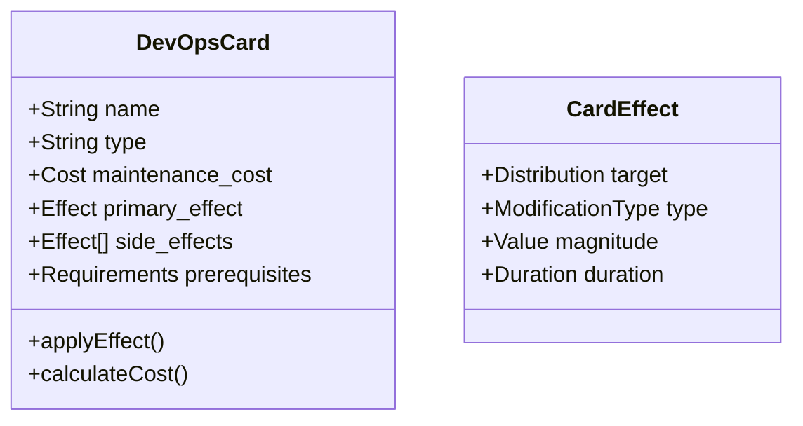
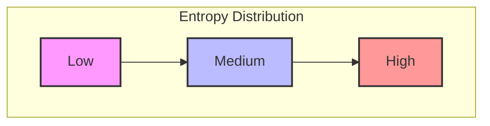

# DevOps Entropy - Game Design Document 🎮

## Game Flow Diagram



## Distribution Interaction Model



## Card Structure



## UI Mockups

### Main Game Interface
```ascii
+------------------------------------------+
|  Sprint 3/12    Revenue: $150k   ⚠️ 2    |
+------------------------------------------+
|                                          |
|     [Distribution Visualizations]         |
|     📊 Entropy                           |
|     📈 Behavior                          |
|     📉 Customer                          |
|                                          |
+------------------------------------------+
|                                          |
|     🃏 Your Hand                         |
|     +-------------+ +-------------+      |
|     |Deploy Monitor| |Add Redundan.|     |
|     |Cost: 2      | |Cost: 3      |     |
|     |Effect: -30% | |Effect: +20% |     |
|     |entropy var  | |reliability  |     |
|     +-------------+ +-------------+      |
|                                          |
+------------------------------------------+
|     📋 Event Log                         |
|     > Incident detected in payment sys   |
|     > Customer satisfaction -5%          |
|     > Deployed monitoring solution       |
+------------------------------------------+
```

### Card Detail View
```ascii
+------------------------------------------+
|     🃏 Deploy Monitoring                  |
+------------------------------------------+
|                                          |
|  Cost: 2 DevOps Points                   |
|  Maintenance: 1 per sprint               |
|                                          |
|  Primary Effect:                         |
|  - Reduces entropy variance by 30%       |
|                                          |
|  Side Effects:                           |
|  + Early warning on incidents            |
|  + Improves customer confidence          |
|  - Increases system complexity           |
|                                          |
|  Prerequisites:                          |
|  - Basic Infrastructure                  |
|                                          |
+------------------------------------------+
```

## Distribution Visualization



## Key UI Elements

1. **Distribution Panels**
   - Real-time visualization of all three distributions
   - Interactive tooltips showing current values
   - Highlighting of dangerous thresholds

2. **Card Hand**
   - Visual representation of available cards
   - Cost and effect previews
   - Drag-and-drop interface for card play

3. **Event Log**
   - Scrolling feed of system events
   - Color-coded by severity
   - Clickable for detailed information

4. **Sprint Dashboard**
   - Current sprint number
   - Revenue tracker
   - Active incident counter
   - System health indicators

## Card Types

1. **Infrastructure Cards** 🏗️
   - Deploy Monitoring
   - Add Redundancy
   - Scale Horizontally
   - Implement Caching

2. **Process Cards** 📋
   - Automate Tests
   - Implement CI/CD
   - Document Systems
   - Train Team

3. **Architecture Cards** 🏛️
   - Refactor System
   - Implement Microservices
   - Add Service Mesh
   - Enable Auto-scaling

4. **Culture Cards** 👥
   - Blameless Postmortems
   - Knowledge Sharing
   - Chaos Engineering
   - DevOps Training

Each card type has a distinct visual style and color scheme to aid quick recognition during gameplay.