# System Graph & Technical Debt Mechanics 🕸️

## Sprint Structure


## Architecture Patterns (Starting Graphs)


## Node Properties
```typescript
interface SystemNode {
    health: number;          // 0-100%
    techDebt: number;        // Accumulating burden
    complexity: number;      // Increases with connections
    contagionRisk: number;   // How likely to spread tech debt
    operatingCost: number;   // Base cost per sprint
    criticalPath: boolean;   // Is it on the money-making path?
    attributes: string[];    // Special flags like "critical", "legacy", "regulated"
    
    // Performance Characteristics
    latency: Distribution;   // Response time distribution
    failureRate: Distribution; // Probability of failures
    defectRate: number;      // Generated by tech debt
}
```

## Edge Properties
```typescript
interface SystemEdge {
    reliability: number;     // Connection health
    latency: Distribution;   // Performance impact distribution
    techDebtSpread: number; // How much debt transfers
    bandwidth: number;      // Capacity for load
    failureRate: Distribution; // Connection failure probability
}
```

## Tech Debt Dynamics


### Defect Generation Formula
For each node per sprint:
```typescript
defects = base_defect_rate * 
          (1 + tech_debt_factor)² * 
          complexity_multiplier
```

### Tech Debt Spread Formula
For each node `n` per sprint:
```typescript
spreadFactor = sum(
    connected_nodes.map(c => 
        c.techDebt * 
        edge(n,c).techDebtSpread * 
        n.contagionRisk *
        (1 + c.complexity/10)  // More complex nodes spread more debt
    )
)
```

## Simulation Phase Mechanics

### 1. Planning Phase
- Review system state and metrics
- Draw available action cards
- Queue changes for the sprint
- Allocate resources and budget
- **No changes allowed after this phase**

### 2. Execution Phase
1. Apply queued changes from planning
2. Run system simulation:
   - Process all node latencies
   - Calculate failure cascades
   - Generate new defects
   - Spread tech debt
3. Calculate financial impact:
   - Operating costs
   - Revenue from successful transactions
   - Incident costs from failures
4. Update system state for next sprint

## Card Types and Effects

### Infrastructure Cards
- Add/Remove nodes
- Modify node properties
- Add redundancy (parallel paths)
- **Cannot modify nodes marked "critical" without prerequisites**

### Architecture Cards
- Restructure connections
- Split/Merge nodes
- Change node types
- **Higher risk of failure when modifying highly connected nodes**

### Process Cards
- Modify edge properties
- Change contagion risks
- Improve reliability
- **More expensive for nodes with high tech debt**

### Maintenance Cards
- Reduce tech debt
- Simplify connections
- Optimize costs
- **Effect reduced by system complexity**

## Visualization Example

```mermaid
graph TD
    subgraph System with Tech Debt
        A[Frontend<br/>Latency: 250ms 🔴<br/>Defects: High] -->|"Reliability: 65%"| B[API<br/>Latency: 150ms 🟡<br/>Defects: Medium]
        B -->|"Latency: 500ms"| C[Database<br/>Critical Node<br/>Defects: High]
        B -->|"Failure Rate: 5%"| D[Legacy Service<br/>Cannot Remove]
        
        style A fill:#ff9999,stroke:#333,stroke-width:2px
        style B fill:#ffff99,stroke:#333,stroke-width:2px
        style C fill:#ff9999,stroke:#333,stroke-width:4px
        style D fill:#ff9999,stroke:#333,stroke-width:2px
    end
```



## Game Over Conditions

1. **Primary: Bankruptcy**
   - Negative cash balance
   - No available credit/loan cards
   - Cannot pay operating costs

2. **Optional Secondary Conditions**
   - Critical system failure cascade
   - Regulatory compliance failure
   - Customer satisfaction below threshold

## Easter Eggs 🥚

- Hidden "Legacy COBOL System" node that's impossible to remove
- "It Works on My Machine" certification reduces testing costs but increases risk
- "Coffee Machine Microservice" that inexplicably becomes critical infrastructure
- "The Mythical Man-Month" card that makes everything worse when you add resources
- "Quantum Entangled Services" where fixing one bug creates exactly one bug elsewhere
